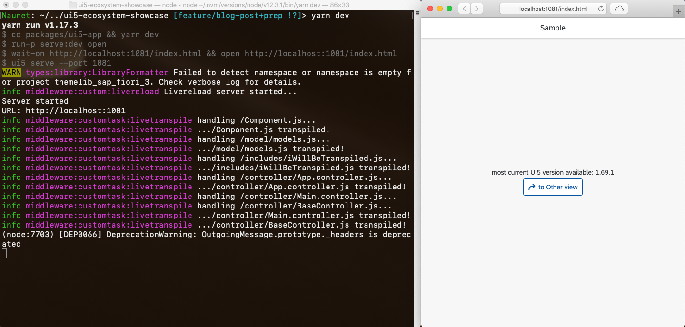

# utilize `ui5-tooling`'s extension capabilites for an improved development experience

Before [`ui5-tooling`](https://github.com/SAP/ui5-tooling) entered the stage, the UI5-verse had baked many handcrafted solutions for allowing local UI5 development. There were (and still are!) many shades of skillful tool combinations, from `grunt` to `gulp` to `node`-scripts, that served resources, proxied requests and generated sources. 

But all of them shared the same challenge: none were officially released, maintained or supported by SAP, nor by the UI5-team. `ui5-tooling` changed that: a toolkit, released and maintained by the UI5 team, positioned to be the go-to instrument for local UI5 development.

In addition to this unified development approach, it immediately brought the UI5 developer community two major benefits: 

1. [`ui5 serve`](https://github.com/SAP/ui5-server) the local UI5 application with [locally installed UI5 sources (via `npm`)](https://sap.github.io/ui5-tooling/pages/GettingStarted/#setup)
2. [`ui5 build`](https://github.com/SAP/ui5-builder) the local UI5 application, for
   - generating the [infamous `Component-preload.js](https://sap.github.io/ui5-tooling/api/module-@ui5_builder.tasks.html#.generateLibraryPreload)`
   - [building a UI5 application bundled with its' UI5 resources](https://sap.github.io/ui5-tooling/api/module-@ui5_builder.tasks.html#.generateStandaloneAppBundle), for stand-alone usage scenarios and maximum performance

Forward to July 2019, when [this commit](https://github.com/SAP/ui5-server/commit/037b3bc001b86061c807e78584e69c53e89d8b96) set ground for the topic this blog post is about: **extend ui5-tooling with custom tasks and custom server-middleware**.

## set the stage

So [Peter Müßig](https://people.sap.com/peter.muessig) and me sat together one afternoon (yeah, beverages were involved) and started putting together [an example showcase](https://github.com/petermuessig/ui5-ecosystem-showcase). It consist of a small UI5 application, whose development time is boosted via several custom middleware extension, along with one custom task. All extensions are available as `npm` modules for reuse.

All you need to do is run `yarn dev` and off it goes:



> Talk is cheap, show me the code:
>
> - Example showcase at https://github.com/petermuessig/ui5-ecosystem-showcase
>
> - `npm` module searches:
>   middlewares via https://www.npmjs.com/search?q=ui5-middleware ,
>   task via https://www.npmjs.com/search?q=ui5-task

## available custom modules

For reference, here's what's available as of pusblishing this blog post:

- `ui5-middleware-cfdestination`: reuse destinations set up in SAP CP Cloud Foundry for local proxying
- `ui5-middleware-livereload`: automatic stateful reload of UI5 application when source files change
- `ui5-middleware-livetranspile`: transparent transpilation of `ES6`+ JS sources during `ui5 serve`
- `ui5-middleware-proxy`: simple proxy for remote systems, fulfilling browser runtime CORS policy
- `ui5-task-transpile`: transpile `ES6`+ JS sources for `ui5 build`

## use `npm` modules for middleware and tasks

The extension concept of `ui5-server` can be used with `npm`: install a module, the configure it for use with `ui5 serve`.

Here's how, for an existing UI5 application:

### init the app for use with `ui5-tooling`

As described in the [UI5 Tooling - Getting Started](https://sap.github.io/ui5-tooling/pages/GettingStarted/):

```bash
$> npm install --global @ui5/cli # install ui5-tooling globally
$> npm install --global yarn # we're using yarn over npm in the showcase
$> cd app
$/app> npm init --yes # generate a package.json
$/app> ui5 init # generate ui5.yaml
$/app> npm install @openui5/sap.ui.core, ... # install ui5 libs
```

### install and configure middleware extension

Installation is "as usual" via `npm` (or `yarn`):

```bash
$/app> npm install ui5-middleware-livereload --save-dev # custom middleware extension, yay!
```

Configuration is two-fold:

- in your app's `package.json`
- in your app's `ui5.yaml`

```json
// package.json
{
  // ...
  "ui5": {
        "dependencies": [
            "ui5-middleware-livereload"
        ]
    }
}
```

```yaml
// ui5.yaml
// ...
server:
  customMiddleware:
  - name: ui5-middleware-livereload
    afterMiddleware: compression
    configuration:
      debug: true
      port: 35729
      path: webapp
```

That's it!

Once you run `ui5 serve` in your `/app` directory, you should see the middleware light up in your console:

```bash
info middleware:custom:livereload Livereload connecting to port 35729 for path webapp
Watching /path/to/app/webapp...

info middleware:custom:livereload Livereload server started...
Server started
```

Subsequently, any changes to a `js`-file (or `css`, `html`, `xml`, `properties`, ...) will trigger a live reload of the app - in all (!) browsers having the app open. See [the documentation of `ui5-middleware-livereload`](https://github.com/petermuessig/ui5-ecosystem-showcase/blob/master/packages/ui5-middleware-livereload/README.md) for further information on the middleware.

The above install- and config-approach holds true for all middleware/tasks of the ui5-ecosystem showcase. See the [included example app configuration (`ui5.yaml`) for a comprehensive example](https://github.com/petermuessig/ui5-ecosystem-showcase/blob/master/packages/ui5-app/ui5.yaml).

## what is this magic?

aka: "*how to roll your own middleware/task*" :)

### implementation

For developing a custom middleware or task, the extension needs to implement a certain `function` signature, whether it's a [middleware](https://sap.github.io/ui5-tooling/pages/extensibility/CustomServerMiddleware/) or a [task](https://sap.github.io/ui5-tooling/pages/extensibility/CustomTasks/):

```javascript
/**
 * Custom UI5 Server middleware example
 *
 * @param {Object} parameters Parameters
 * @param {Object} parameters.resources Resource collections
 * @param {module:@ui5/fs.AbstractReader} parameters.resources.all Reader or Collection to read resources of the root project and its dependencies
 * @param {module:@ui5/fs.AbstractReader} parameters.resources.rootProject Reader or Collection to read resources of the project the server is started in
 * @param {module:@ui5/fs.AbstractReader} parameters.resources.dependencies Reader or Collection to read resources of the projects dependencies
 * @param {Object} parameters.options Options
 * @param {string} [parameters.options.configuration] Custom server middleware configuration if given in ui5.yaml
 * @returns {function} Middleware function to use
 */
module.exports = function({resources, options}) {
    return (req, res, next) => {
        // [...]
    }
};
```

For the middleware, the `function` signature is [connect](https://github.com/senchalabs/connect)- and [express](https://expressjs.com)-compatible. So all middleware suitable for those two frameworks are in principal compatible to `ui5-server` as well!

### file system structure, configuration

The implementation `js`-file(s) need to go into a folder with a dedicated name, containing several mandatory files. Take `ui5-middleware-livereload` as an example:

```
ui5-middleware-livereload
├── README.md
├── lib
│   └── livereload.js
├── node_modules
├── package.json
└── ui5.yaml
```

- `ui5.yaml` describes the extension and is self-explanatory:

  ```yaml
  specVersion: '1.0'
  metadata:
    name: ui5-middleware-livereload
  kind: extension
  type: server-middleware
  middleware:
    path: lib/livereload.js
  ```

- `package.json` is an `npm`-standard like file for descripting the package

Yep, you guessed it: looking at the latter, this fulfills the requirement of **publishing the UI5 server extension as a publicly available `npm` module**.

**For re-use.**

**By the entire UI5-verse of developers.**

Which brings us to...

## what next?

You guys: **Go code**.

Lots of `ui5-tooling` extensions, be it tasks or middlewares.

**Publish** them on `npm`. Follow the naming convention `ui5-{middleware|task}-{name}`.

So other UI5 developers can **re-use** them. And you can **re-use others'** extensions.

That as a the UI5 development community, we can work better, more efficient, grow in skill and knowledge - and have some fun while doing it! #endlesspossibilities
