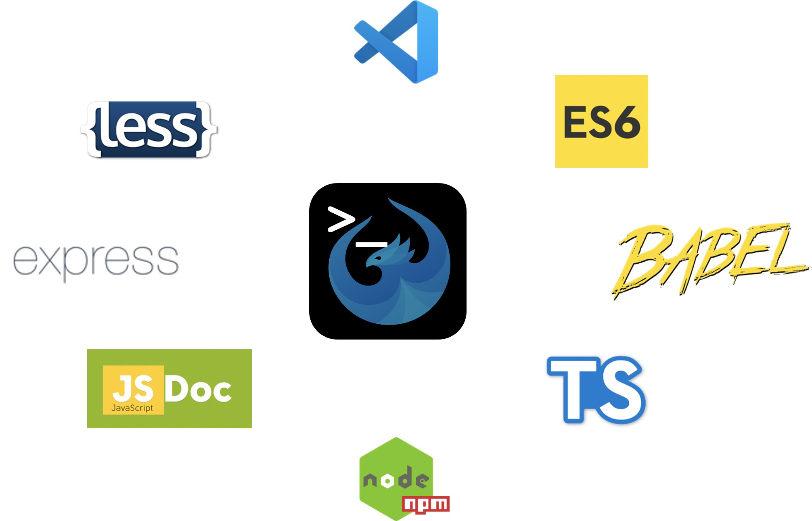

# UI5 Ecosystem Showcase
{: .fs-9 }

Community-maintained UI5 CLI extensions, showcases, and tooling — built and shared by the UI5 community.
{: .fs-6 .fw-300 }

[Browse extensions](./extensions/){: .btn .btn-primary .fs-5 .mb-4 .mb-md-0 .mr-2 }
[Find one on Best of UI5](https://bestofui5.org/){: .btn .fs-5 .mb-4 .mb-md-0 .mr-2 }
[Contribute](./contributing/){: .btn .fs-5 .mb-4 .mb-md-0 }

---

{: .mt-4 }

## What is this?

The [UI5 CLI](https://ui5.github.io/cli/) is built to be extended. This repository — and the [27 NPM packages](./extensions/) it publishes — show how community developers extend it with [custom tasks](https://ui5.github.io/cli/pages/extensibility/CustomTasks/) and [middlewares](https://ui5.github.io/cli/pages/extensibility/CustomServerMiddleware/) to make UI5 development faster, cleaner, and more pleasant.

Anyone can write a task, a middleware, or a full UI5 CLI extension and share it on NPM. Together, that ecosystem covers everything from livereload and TypeScript transpilation to backend proxies, PWA enablement, copyright headers, and direct consumption of NPM modules in UI5 apps.

> **Heads up:** this is a **community project**. There is no official SAP support — but there is an active community on [Slack](https://ui5-slack-invite.cfapps.eu10.hana.ondemand.com/) (#tooling channel) and in [GitHub issues](https://github.com/ui5-community/ui5-ecosystem-showcase/issues).

## Pick your path

| If you want to… | Go to |
| --- | --- |
| Browse the extensions in this repo | [Extensions catalog](./extensions/) |
| Pick the right tool for a specific problem | [Selecting an extension](./selecting/) |
| Connect a UI5 app to a backend | [Backend connectivity](./backend-connectivity/) |
| Contribute your own task / middleware | [Contributing](./contributing/) |
| See repo-wide stats and history | [Insights](./insights/) |
| Search the wider UI5 ecosystem | [bestofui5.org](https://bestofui5.org/) |

## Naming conventions

When you publish your own extension on NPM, please follow the established prefixes — they are how the rest of the ecosystem (and tools like Best of UI5) discovers your work:

- `ui5-task-*` — UI5 CLI tasks (build-time)
- `ui5-middleware-*` — UI5 CLI middlewares (dev-server)
- `ui5-tooling-*` — UI5 CLI extensions that combine both

## Prerequisites

Latest releases of the provided UI5 CLI extensions require at least [`@ui5/cli@3.0.0`](https://ui5.github.io/cli/v3/pages/CLI/) so they can use [`specVersion: "3.0"`](https://ui5.github.io/cli/pages/Configuration/#specification-version-30).

> All major-version-3 extensions require UI5 CLI V3. Older releases (where available) keep working with older UI5 CLI versions, but using the latest CLI is strongly recommended.
