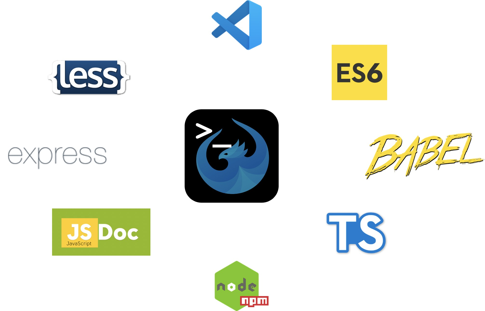

# UI5 Tooling - Ecosystem Showcase

This repository is showcasing the [UI5 Tooling](https://sap.github.io/ui5-tooling/) extensibility capabilities. You can easily extend the UI5 Tooling with your own [tasks](https://sap.github.io/ui5-tooling/pages/extensibility/CustomTasks/) or [middlewares](https://sap.github.io/ui5-tooling/pages/extensibility/CustomServerMiddleware/).

Everyone can develop and share his own tasks, middleware, and tooling extensions or consume them via [NPM](https://www.npmjs.com/). On NPM, all tasks are prefixed with `ui5-task-` and all middlewares with `ui5-middleware-`. In case you create NPM packages having both: custom tasks and middlewares, the prefix should be `ui5-tooling-`. This will help UI5 developers to easily find tasks and middlewares created and shared by the UI5 community.

## Contribute to the UI5 Tooling Ecosystem

You can contribute to the UI5 Tooling Ecosystem by providing your own task, middlewares, and/or tooling extensions. Therefore, you have the possibility to either contribute your extension to this repository or do it in your own repository. In both cases, please consider to contribute your extension to [Best Of UI5](https://bestofui5.org/) and *[Add Your Own Package](https://github.com/ui5-community/bestofui5-data/issues/new?assignees=marianfoo&labels=new%20package&template=new_package.md&title=Add%20new%20Package:)*.

### Contributing

This repository is open to anyone who wants to share his/her task or middleware with the UI5 community. By integrating an extension in this repository you can benefit from automated releases of the tasks and middlewares to the public npm registry. But we ask you to continue to support your extension and handle open issues. In addition, you will get a review before your task or middleware is merged.

### Self-managed

The other option is to self-manage your extensions in your own repository. In this case, you'll have full control but need to implement your own release process. Please ensure to stick to the naming convention as described above and check for duplicated tasks at [Best Of UI5](https://bestofui5.org/) or in the [NPM registry](https://www.npmjs.com/).

## Available Tooling Extensions

Tooling extensions are either tasks, middlewares or combining both in one tooling extension NPM package. The NPM packages including tasks only are prefixed with `ui5-task-` and middlewares only with `ui5-middleware-`. NPM packages including both are prefixed with `ui5-tooling-`.

The best place to find existing tooling extensions is [Best Of UI5](https://bestofui5.org/). This is the central registry for available tasks, middlewares, tooling extensions, libraries, modules, custom controls, Yeoman generators, wdi5 plugins, commands and even applications. The metadata will also be used by several open-source tools to provide a better development experience by recommending tooling extensions, libraries, ...

### Tasks

At [Best Of UI5](https://bestofui5.org/) you can find the [available UI5 tooling tasks](https://bestofui5.org/#/packages?tokens=task:type). There might be more tasks in the public NPM registry. You can find all tasks which applied the suggested naming convention via [https://www.npmjs.com/search?q=ui5-task-](https://www.npmjs.com/search?q=ui5-task-).

### Middlewares

At [Best Of UI5](https://bestofui5.org/) you can find the [available UI5 tooling middlewares](https://bestofui5.org/#/packages?tokens=middleware:type). There might be more middlewares in the public NPM registry. You can find all middlewares which applied the suggested naming convention at [https://www.npmjs.com/search?q=ui5-middleware-](https://www.npmjs.com/search?q=ui5-middleware-).

### Tooling Extensions

At [Best Of UI5](https://bestofui5.org/) you can find the [available UI5 tooling extensions](https://bestofui5.org/#/packages?tokens=tooling:type). There might be more tooling extensions in the public NPM registry. You can find all middlewares which applied the suggested naming convention at [https://www.npmjs.com/search?q=ui5-tooling-](https://www.npmjs.com/search?q=ui5-tooling-).
