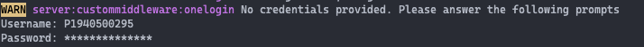

# UI5 onelogin middleware

> :wave: This is a **community project** and there is no official support for this package! Feel free to use it, open issues, contribute, and help answering questions.

Middleware for [ui5-server](https://github.com/SAP/ui5-server), enabling a generic login support.

The middleware will on first request try to login with the provided credentials and save the cookie for further requests. This uses playwright in a headless mode to run the login process.
The first request will take longer.

This has been tested with Azure AD, Google, OpenAM and the SAP Gateway login pages.

Merge requests with other login handlers are more than welcome via pull request.

## Prerequisites

- Requires at least [`@ui5/cli@3.0.0`](https://sap.github.io/ui5-tooling/v3/pages/CLI/) (to support [`specVersion: "3.0"`](https://sap.github.io/ui5-tooling/pages/Configuration/#specification-version-30))

> :warning: **UI5 Tooling Compatibility**
> All releases of this tooling extension using the major version `3` require UI5 Tooling V3. Any previous releases below major version `3` (if available) also support older versions of the UI5 Tooling. But the usage of the latest UI5 Tooling is strongly recommended!

## Install

```bash
npm install ui5-middleware-onelogin --save-dev

```

## Configuration options (in `$yourapp/ui5.yaml`)

You can define the properties either in the configuration (YAML file) or using environment variables. The order of precedence is:

1. YAML file configuration
2. Environment variables
3. Default configuration

**Important:** When configuring `ClientCertificate`, you must define all its properties either in the YAML file or in environment variables. Mixing definitions between YAML and environment variables for `ClientCertificate` is not supported.

Currently, you can define the following properties:

- path: `string` either the url or the hostname and port of the SAP system
- subdirectory`(optional)`: `string` the subdirectory that is appended to the path, defaults to the fiori launchpad at /sap/bc/ui2/flp
- username`(optional)`: `string` Username to be used to login to the launchpad
- password`(optional)`: `string` Password used to login
- useCertificate`(optional)`: `boolean` use a certificate to login instead of username and password
- debug`(optional)`: `boolean` true will open up the playwright browser so you can see what's going on

**NB1:** If you choose to use the certificate login then check the property AutoSelectCertificateForUrls in chrome://policy if it holds the url pattern for your system. [Playwright](https://github.com/microsoft/playwright/issues/1799) has an issue to handle the certificate prompt. Another workaround is to set debug and useCertificate to true in the configuration and press ok when the prompt opens

**NB2:** If your system does not host a fiori launchpad, you will have to adjust the subdirectory to point to a different login protected page. In the case of a MII java stack that hosts an OData service, try setting subdirectory to XMII/PropertyAccessServlet?Mode=List

- ClientCertificate`(optional)`: `object` Configuration for client certificate authentication
  - origin: `string` Exact origin that the certificate is valid for. Origin includes https protocol, a hostname and optionally a port.
  - certPath: `string` Path to the file with the certificate in PEM format.
  - keyPath: `string` Path to the file with the private key in PEM format.
  - pfxPath: `string` Path to the PFX or PKCS12 encoded private key and certificate chain.
  - passphrase: `string` Passphrase for the private key (PEM or PFX).

You can set the following environment variables in your .env file (remember to add it to your .gitignore):

You can either add the following properties to your .env file, remember to add that to your .gitignore

- UI5_MIDDLEWARE_ONELOGIN_LOGIN_URL or UI5_MIDDLEWARE_SIMPLE_PROXY_BASEURI
- UI5_MIDDLEWARE_ONELOGIN_LOGIN_SUBDIRECTORY
- UI5_MIDDLEWARE_ONELOGIN_USERNAME
- UI5_MIDDLEWARE_ONELOGIN_PASSWORD
- UI5_MIDDLEWARE_ONELOGIN_USE_CERTIFICATE
- UI5_MIDDLEWARE_ONELOGIN_QUERY or UI5_MIDDLEWARE_SIMPLE_PROXY_QUERY
- UI5_MIDDLEWARE_ONELOGIN_DEBUG

Use of environment variables or values set in a `.env` file will be used.

Other options is to either set it in the yaml file or if left blank it will prompt you for the details.

You can choose to just add the url and let the rest be prompted in the terminal


## Usage

1. Define the dependency in `$yourapp/package.json`:

```json
"devDependencies": {
    // ...
    "ui5-middleware-onelogin": "*"
    // ...
}
```

2. configure it in `$yourapp/ui5.yaml`:

```yaml
server:
  customMiddleware:
    - name: ui5-middleware-onelogin
      afterMiddleware: compression
      configuration:
        path: <Login URL>
        username: <Login User>
        password: <Login Password>
        useCertificate: true / false (use a certificate to login instead of username and password)
        debug: true / false (true will open up the playwright browser so you can see what's going on)
        query:
          sap-client: "206"
```

## License

This work is [dual-licensed](../../LICENSE) under Apache 2.0 and the Derived Beer-ware License. The official license will be Apache 2.0 but finally you can choose between one of them if you use this work.
